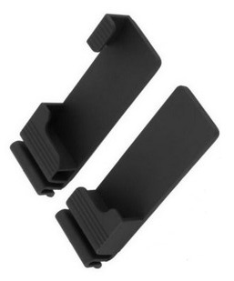
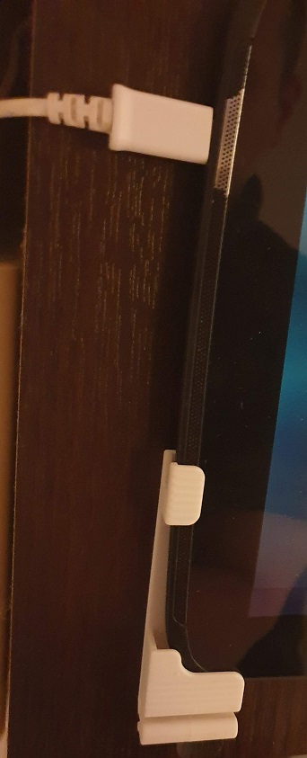
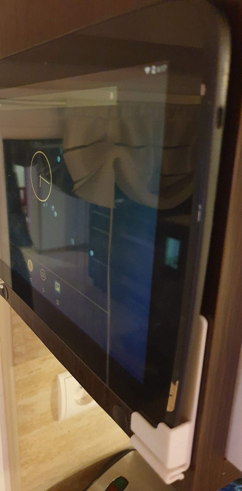
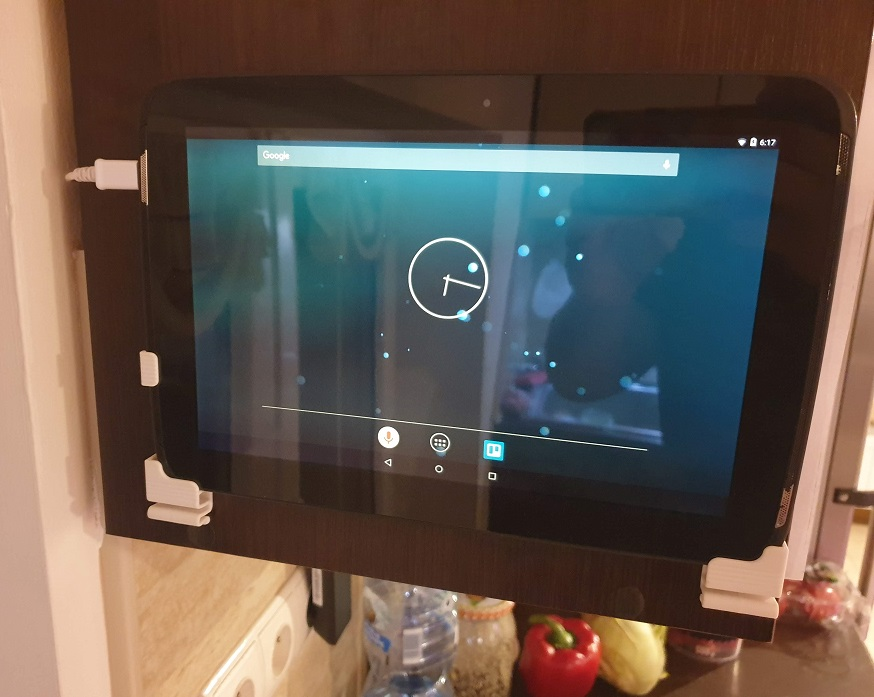
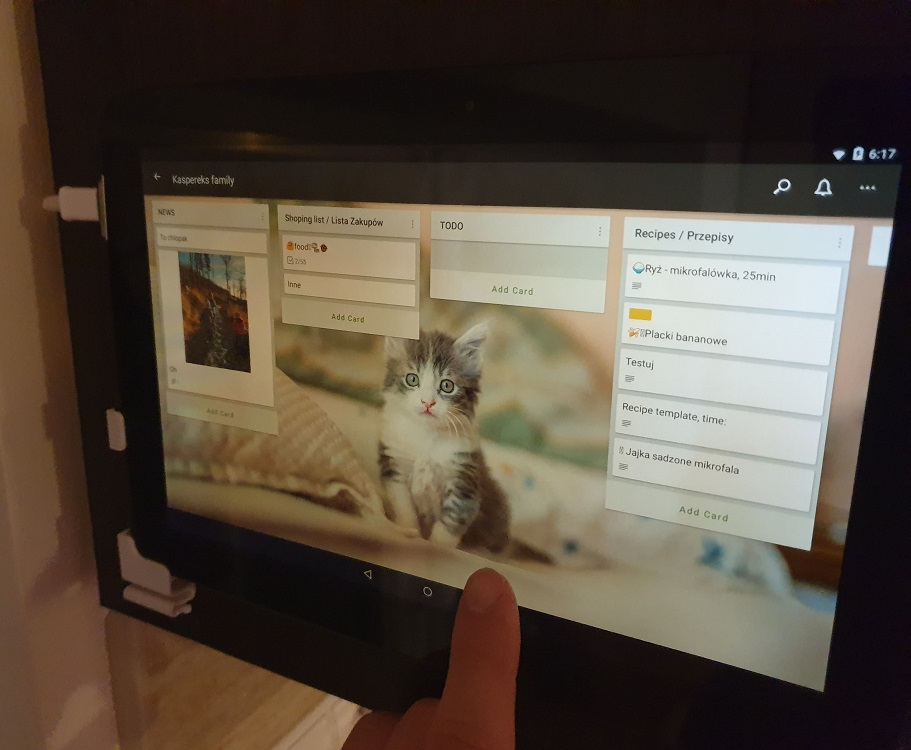
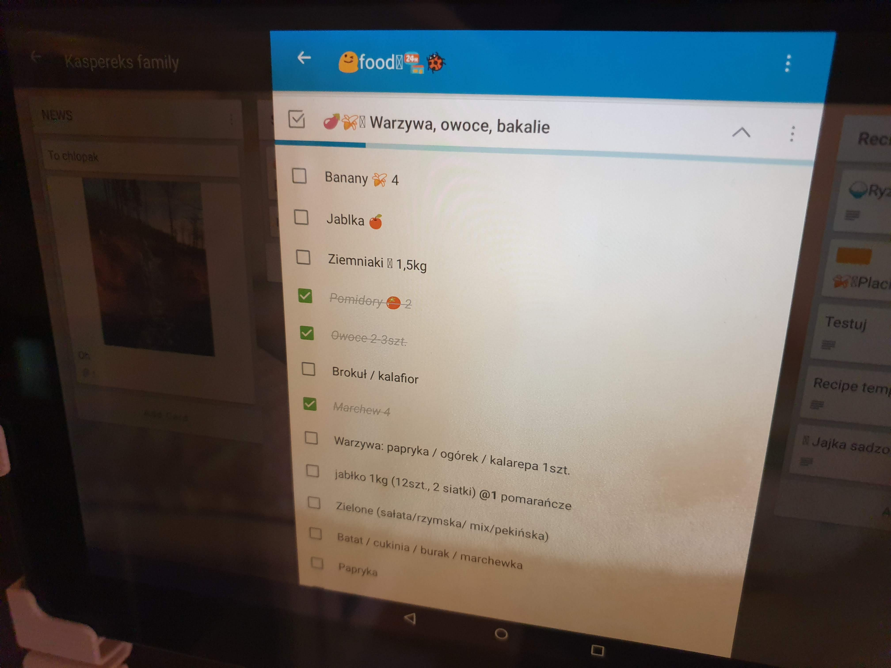
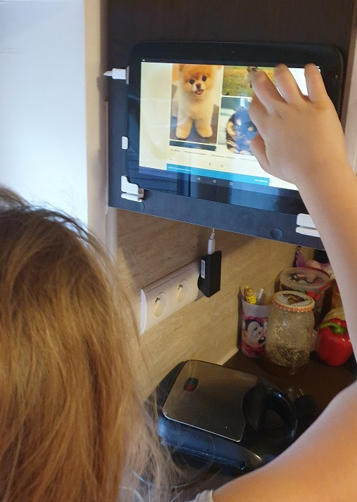

# kitchen_tablet

## How to use old tablet as kitchen tablet or family hub.

### Goal:
affordable kitchen device that synchronize with residents' smartphones

### Use cases:
- shopping list,
- kitchen timer and digital assistant,
- recipes - storing and reading,
- house todo list,
- house calendar,
- information board,
- photo frame.

## Hardware:
- tablet compatible with below software (under $50),
- tablet wall mount (under $15):  
   https://www.amazon.com/Universal-Tablet-Holder-Surface-Brainwavz/dp/B07Y84F85V  
   or   

## Software:
- Trello app (free):  
   https://trello.com/
- Digital assistant (free):  
   Siri / Google Assistant / Alexa / Cortana
   
## Settings:
- display timeout for 10-20min (for comfortable recipe reading)

## Mounting:

## Nexus 10 and Trello as family hub:

## Shopping list:

## Kids talking with assistant :)

## Tips:
- you can use tablet with broken battery
